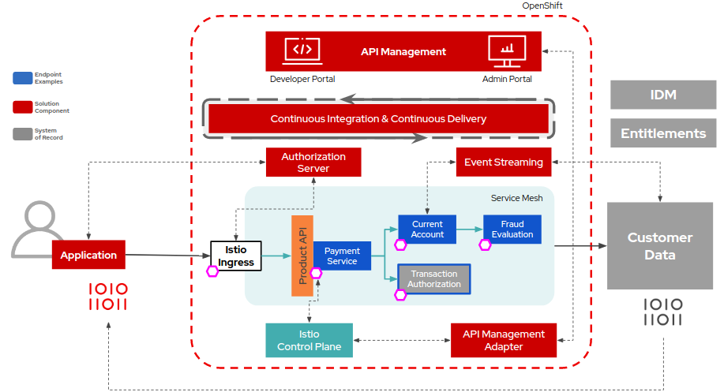

# Open API Sandbox for Banking

Open Banking has captured the imagination of digital leaders and is emopowering customers to use new digital services with their banking information. Harnessing the power of platform that is open source, is helping banks to be in control of their own destintity and accelerating innovation.

Create an ecosystem, connect with your customers or simply make it easier to partner with you. The objective of this project is to provide a an accelerator for open banking that is based on open source technology.

The accelerator provides a lightly branded developer portal based on the porta project
https://github.com/3scale/porta

It also includes mocked data that is served up by the microcks project
http://microcks.github.io/

The content and code from the United Kingdom is publicly available at both their developer zone site, which is located at https://openbanking.atlassian.net/wiki/spaces/DZ/overview. You can find additional information on GitHub.

New specifications may be introduced in the future and existing specifications will be updated periodically. Individuals are welcome to contribute.

## Overview video

<iframe width="560" height="315" src="https://www.youtube.com/embed/SrZHoGS8Lk4" frameborder="0" allow="accelerometer; autoplay; clipboard-write; encrypted-media; gyroscope; picture-in-picture" allowfullscreen></iframe>

## Contributing

1. Fork it (<https://github.com/open-accelerators/open-banking>)
2. Create your feature branch (`git checkout -b feature/fooBar`)
3. Read our [contribution guidelines](CONTRIBUTING.md) and [Community Code of Conduct](https://developers.redhat.com/)
4. Commit your changes (`git commit -am 'Add some fooBar'`)
5. Push to the branch (`git push origin feature/fooBar`)
6. Create a new Pull Request

## License

Copyright 2018-2020 Red Hat, Inc.

Distributed under the [Apache License, Version 2.0](http://www.apache.org/licenses/LICENSE-2.0).

SPDX-License-Identifier: [Apache-2.0](https://spdx.org/licenses/Apache-2.0)
